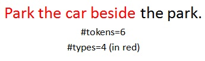

Tokens correspond to the total number of word counts in a text while type corresponds to the total count of unique words in a text.

#### Objective

The objective of this experiment is to impart basic knowledge about the distinction between types and tokens. 